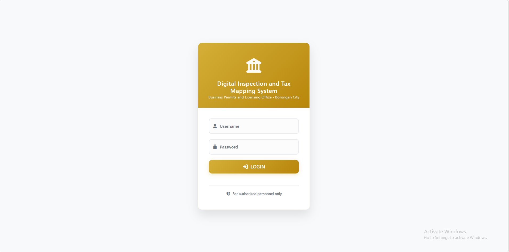
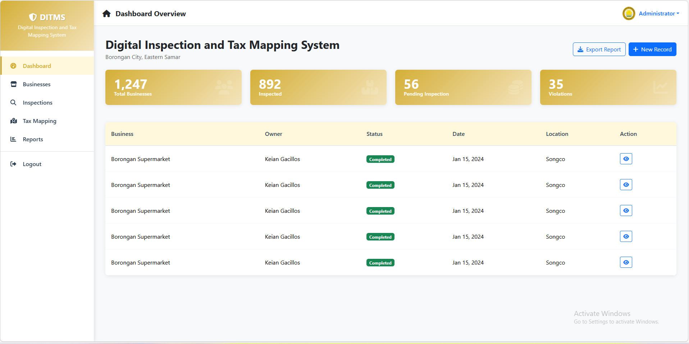
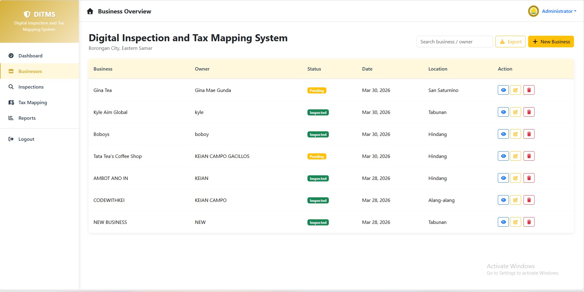
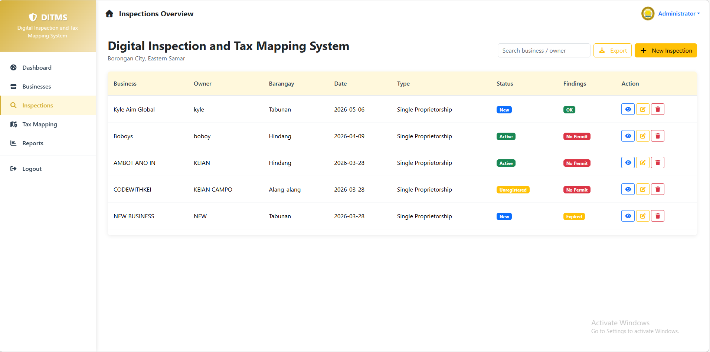
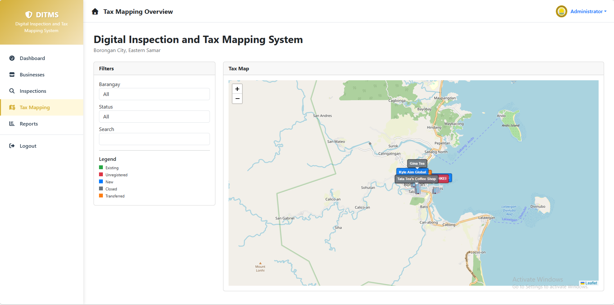
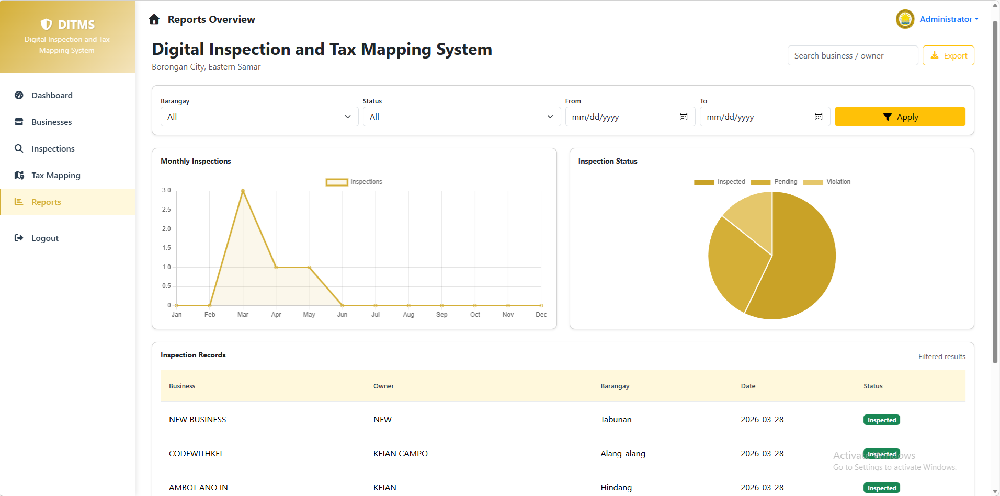

# Digital Inspection and Tax Mapping System

## 🚀 Overview

The Digital Inspection and Tax Mapping System is a web-based application developed for a capstone project requested by a local government office.
The system is designed to digitize business inspection records, manage establishment information, and support tax mapping through a centralized database.

The goal of the project is to replace manual recording with a more efficient digital system that allows inspection monitoring, report generation, and location visualization.

This project is currently under development.

---

## 🎯 Project Goals

* Digitize inspection and monitoring processes
* Improve accuracy of business records
* Provide centralized data management
* Enable faster report generation
* Support mapping of business locations
* Increase efficiency in government operations

---

## 🏗️ System Architecture

The application follows a classic **LAMP-style web architecture**:

Frontend

* HTML5
* CSS3
* Bootstrap 5
* JavaScript
* jQuery

Backend

* PHP (Core PHP, procedural / PDO)
* MySQL Database

Async / Data Handling

* AJAX
* JSON

Environment

* XAMPP (Apache / PHP / MySQL)
* Localhost Development

---

## ⚙️ Core Features

### 🔐 Authentication System

* Admin login

### 🏢 Business Establishment Management

* Add / Edit / Delete business records
* Store owner information
* Store location details
* Database-driven forms

### 🧾 Inspection Module

* Record inspection results
* Update inspection status
* Store inspection history

### 🗺️ Tax Mapping / Location Module

* Display business locations
* Mapping visualization
* Location-based monitoring

### 📊 Reporting System

* Generate inspection reports
* Printable records
* Database filtering

### ⚡ AJAX-powered Interface

* Dynamic table updates
* Modal form loading
* No page reload CRUD
* JSON responses

### 🎨 UI / UX

* Responsive design
* Bootstrap layout

---

## 📌 Project Status

🚧 In Development

This system is being developed for a capstone project based on client requirements
and is currently running in a localhost development environment.
The project is running in a localhost environment during development.

---

## 📷 Screenshots

### Login

### Dashboard

### Business

### Inspection

### Tax Mapping

### Reports

---

## 🔒 Note

This project is part of a client academic project.
Some features and data are not publicly available.

---

## 👨‍💻 Developer

**Keian Camposano Gacillos**
Full-Stack Web Developer

Portfolio
https://www.keiancamposanogacillos.online

GitHub
https://github.com/ItsmeKeian

---

## ⭐ Notes

This project demonstrates experience in:

* Full-stack web development
* Government system development
* CRUD system architecture
* AJAX / jQuery dynamic UI
* MySQL database design
* Real client project workflow
